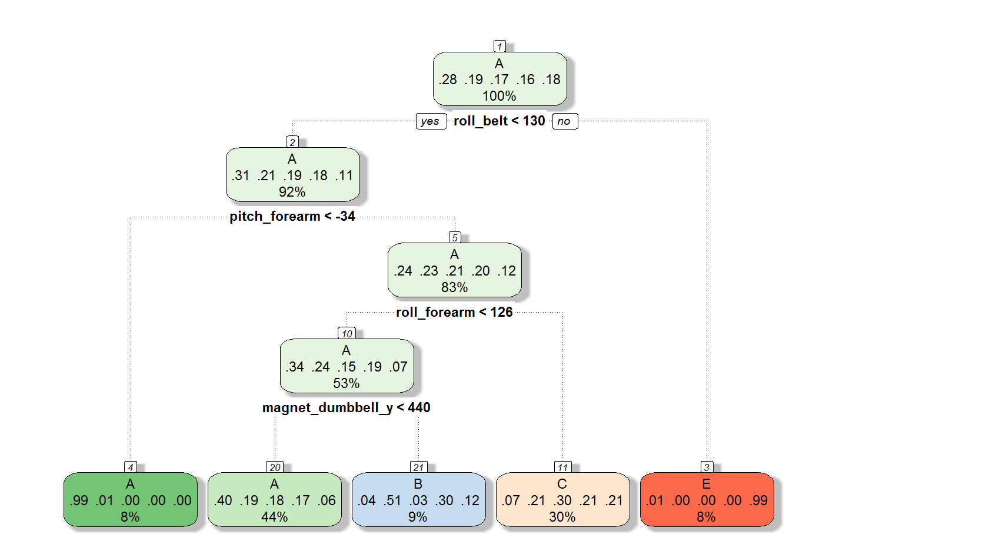

Practical Machine Learning: Exercise Classe Prediction
====================================
##### by DLameyer


### Summary
The purpose of this assignment is to apply machine learning priciples to the exercise data set and predict the classe of the excercise based on a record's attributes. First a decision tree model was used with a 10 k fold cross validation. However, this machine learning method could not yield a confident enough prediction model to be utilized in the testing assignment (Less than 50% rate of accuracy). The next model built utilized random forest method which was able to produce a much better rate of accuracy when predicting (Over 90%). The results of the random forest method model on the test data set can be found at the end of the report.

###Background
Using devices such as Jawbone Up, Nike FuelBand, and Fitbit it is now possible to collect a large amount of data about personal activity relatively inexpensively. These type of devices are part of the quantified self movement – a group of enthusiasts who take measurements about themselves regularly to improve their health, to find patterns in their behavior, or because they are tech geeks. One thing that people regularly do is quantify how much of a particular activity they do, but they rarely quantify how well they do it. In this project, your goal will be to use data from accelerometers on the belt, forearm, arm, and dumbell of 6 participants. They were asked to perform barbell lifts correctly and incorrectly in 5 different ways. More information is available from the website here: http://groupware.les.inf.puc-rio.br/har (see the section on the Weight Lifting Exercise Dataset).


# Set Up:
### Import Data
The assignment provides two data sets. pml-training.csv will be use to train the model, while pml-testing.csv will be the data set which the model will be tested on. Loading the pml training and testing data as provided by the assignment.
```{r warning = FALSE}
training <- read.csv("pml-training.csv", na.strings = c("NA", ""))
testing <- read.csv("pml-testing.csv", na.strings = c("NA", ""))
```

### Prepare packages and Set Seed

```{r warning = FALSE, message=FALSE}
set.seed(1022)
```
The model created for this exercise utilizes multiple packages. Please install the following libraries:
```{r warning = FALSE, message=FALSE}
library(caret);
library(rpart);
library(rpart.plot);
library(rattle);
library(e1071);
library(randomForest)
```

### Cleaning the Data
Both the testing and training data have data sets that do not contribute to the prediction model. First, all columns with no data will be removed. Second, the first 7 columns will removed since they only contain unnecessary data such as subject name, time stamps and window data.
```{r warning = FALSE}
## Remove Fields with no Values
training <- training[, colSums(is.na(training)) == 0]
testing <- testing[, colSums(is.na(testing)) == 0]
## Remove Fields 1 - 7 Since They do not contribute to the prediction model
training <- training[, -c(1:7)]
testing <- testing[, -c(1:7)]
```


# Prediction Algorithms:
### Training Data
Partioning the training set into two. 60% of the data will be set to trainingSample and the remaining 40% into testingSample. The trainingsample will be used to build the model, while the testing sample will be used to compare the model's ability to accurately predict the same known classes.

```{r warning = FALSE}
inTrain <- createDataPartition(y=training$classe, p=0.6, list=FALSE)
trainingSample <- training[inTrain, ]
testingSample <- training[-inTrain, ]

dim(trainingSample)
dim(testingSample)
```


### Decision Trees
First attempt at a model will be using Decision Tree matrix on a 10 K-Folds cross validation data set. Decision trees can be good when data sets yield a very consistent pattern of data between classes. 10 separate samples out of the training data will be used to develop the decision tree model. This step prevents the over fitting of the model to the training data set and to demonstrate the model's ability to predict onto new data. Steps to generate this method ar shown below.

```{r warning = FALSE}
control <- trainControl(method = "cv", number = 10)
alg_dt <- train(classe ~ ., data = trainingSample, method = "rpart", trControl = control)

# Print Visual for the Decision tree
fancyRpartPlot(alg_dt$finalModel)
```
 

```{r warning = FALSE}
# predict outcomes using validation set
predict_dt <- predict(alg_dt, testingSample)

# Show prediction result
(conf_rpart <- confusionMatrix(testingSample$classe, predict_dt))

(accuracy_rpart <- conf_rpart$overall[1])
```
A shown above, the the accuracy of the decision tree model only yields a 48.1% accuracy on the testingSample data we set aside. A more accurate machine learning method will be needed before moving to predict the true test data set. Random Forest can be a more trusted method for prediction in this case since it generates numerous decision trees over the same data set and consolidating components into a single model. The next steps show the set up of the random forest model.

### Random Forrest
Applying random forest method to data set to determine a better prediction model than decision tree.

```{r warning = FALSE}
alg_rf <- randomForest(classe ~. , data=trainingSample)


predict_rf <- predict(alg_rf, testingSample, type = "class")
confusionMatrix(predict_rf, testingSample$classe)
```
As seen above, the accuracy of the Random Forest method yield a 99.2% accuracy when predicting aginst the allocated testing sample data set.  With this level of confidence we can confidently move to apply this model directly to the Testing data. In the next section, the random forest model will be used to predict what category of exercise of each line of record.


# Prediction
### Applying Algorithm to Test Data

```{r warning = FALSE}
## > predict(alg_rf, testing, type = "class")
 ## 1  2  3  4  5  6  7  8  9 10 11 12 13 14 15 16 17 18 19 20 
 ## B  A  B  A  A  E  D  B  A  A  B  C  B  A  E  E  A  B  B  B
```
